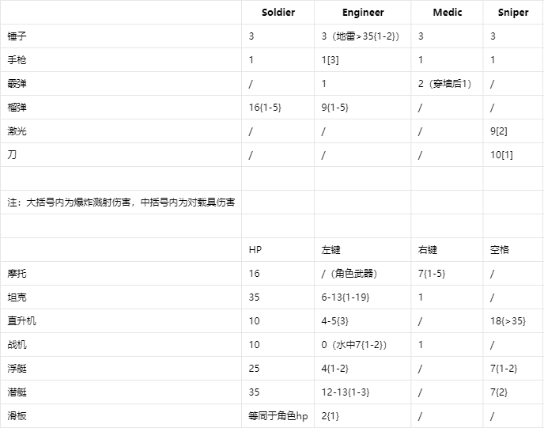

# 战地模式：从入门到入土

## 基本玩法

夺旗一个100分，占点一个20分，任意一方500分胜利

### 如何下车？

发表情或者输入 `/e`
可以在F1界面用 `bind f（或者其它按键） say /e`来快捷绑定，之后按下按键即视为输入 `/e`

## 道具与地形

### 生命台

 靠近后发射爱心治疗玩家（不分敌我），每个爱心2生命

### 烟雾弹

 拿取后在移动中用 `/e`发射，产生大量烟雾，玩家靠近可以隐身

### 手榴弹

每个玩家出生时配备，用 `/e`发射，直接命中造成1伤害，砸地上产生大量1伤害的破片

### 武器包

 拿取后恢复全部弹药、地雷、手榴弹、水下武器等

### 激光门

  

每个门拥有两个开关（激光点），靠近即可开关门  
双方基地里特定的门无法被直接打开，需要工程师的手枪

### 传送门

点位被占领后，对应传送门就会开启，可直接到达点位

### 防空炮

靠近即可进入防空炮，左键发射子弹，对两种飞机5伤害，其它敌方目标1伤害

### 水

水分为两种：

* 非海水（沙漠与丛林出现）：可在水中无限跳跃，可以发射大部分子弹
* 海水（海战与岛屿出现）：按右键在水中游泳，大部分子弹接触水会消失，战斗机投弹入水会变成鱼雷

浸入水中后会出现缓慢消耗的氧气条（即护盾条），氧气归零会开始消耗生命值  
乘坐水下载具时不受氧气条影响

### 水下武器

出现于海战和岛屿两张地图，获取后可在水中按空格抛出

#### 长矛

10弹药，长按空格可以蓄力扔出，最高造成10伤害

#### 箭

15弹药 2伤害

#### 飞镖

5弹药 9伤害

## 占点

每个地图都拥有ABC三个点位  
点位里一般有生命台、武器包等道具和载具，C点往往比其他点位有更多道具  
只有己方拥有的点位才可以获取道具，并从基地里的传送门直接到达点位  
进入对方的点位即开始攻占（进度条显示在屏幕上方），点位内双方人数差距越大，攻占速度越快；如果双方人数相等无法攻占  
受到攻击的点位会向玩家发送警报  
把对方的点位彻底占领（进度条满）可获得20分  

## 职业

玩家选择职业后才能离开出生点
玩家和载具的各种爆炸性武器一般都没有友伤，但有自伤

### 士兵（Soldier）

* 锤子：生成一个弹药包，自己的弹药包每10s才能对自己生效一次
* 手枪：拥有六组弹药，射速极快，每组弹药打完需要一段时间换弹
* 榴弹：左键发射C4（外观为激光弹药，最多3个），可贴在其他玩家身上，右键引爆

### 工程师（Engineer）

* 锤子：生成一颗地雷（最多3个），消灭接触到的敌方单位
* 手枪：长按可以排雷、开关特定的门、修理己方载具、摧毁敌方载具，并对极为靠近的敌方目标造成伤害
* 霰弹：普通的霰弹枪
* 榴弹：发射一枚自动追踪敌方的榴弹，若附近无目标则在鼠标指针附近盘旋

### 医生（Medic）

* 锤子：发射一颗爱心，治疗队友并伤害敌方
* 手枪：具有超强击退
* 霰弹：伤害较高，具有穿透部分墙面的能力

### 狙击手（Sniper）

* 锤子：自然条件下会恢复隐身能量，挥锤可消耗能量进出隐身状态，最多持续5s
* 手枪：普通的手枪
* 激光：可穿透激光门，对载具伤害低
* 忍者刀：可短距离位移，并对路径上目标造成伤害，对载具伤害低，有一定冷却时间

## 载具

接触载具的中心部分可以进入载具，发表情或输入 `/e`离开载具
双方基地的载具不能被对方乘坐，但被己方乘坐过的除外
载具hp归零则会爆炸，车上人员立即死亡
车上人员自杀会导致其他共乘载具的玩家死亡，载具消失
空置载具一段时间也会消失
消失后的载具会在它的出生点重新生成

### 摩托车

移动速度快，在车上可以使用角色自身武器，按右键发射一枚炸弹

### 坦克

移动速度较慢，按左键发射榴弹，右键连续发射高速子弹
玩家可以锤击有队友的坦克共乘，二号位可以左键发射高速的手枪子弹

### 直升机

右键抬升高度，AD键左右移动，左键发射爆炸子弹，空格发射一枚高伤害跟踪弹，具有较长时间冷却  
可以像坦克一样共乘，此时一号位左键发射霰弹，二号位左键发射爆炸子弹  
侧面撞到墙壁会爆炸，导致机上人员立即死亡

### 战斗机

战机固定向鼠标方向飞行，A键减速，D键加速，左键投掷无伤害的榴弹，右键发射高速子弹  
速度为0一段时间后，玩家会自动下飞机  
机头撞击墙壁会爆炸，机上人员立即死亡；有时操作不当也会在下机时爆炸，此时飞机相当于一枚手榴弹  
最吃操作的载具，使用得当可以快速攻入敌人基地，或利用爆炸特性消灭敌方目标

### 浮艇

移速较快，左键发射爆炸子弹，空格发射一枚向下沉的鱼雷

### 潜艇

按住右键，鼠标在屏幕上半则上浮，下半则下沉  
空格发射四枚横向移动的鱼雷  
浮在水面上时，左键可发射一枚榴弹  
碰撞墙壁会损失载具生命值

### 滑板

左键发射慢速的爆炸子弹，长按右键向鼠标方向快速移动
滑板没有独立的生命值，受伤直接扣除玩家生命

## 武器/载具伤害数据一览

